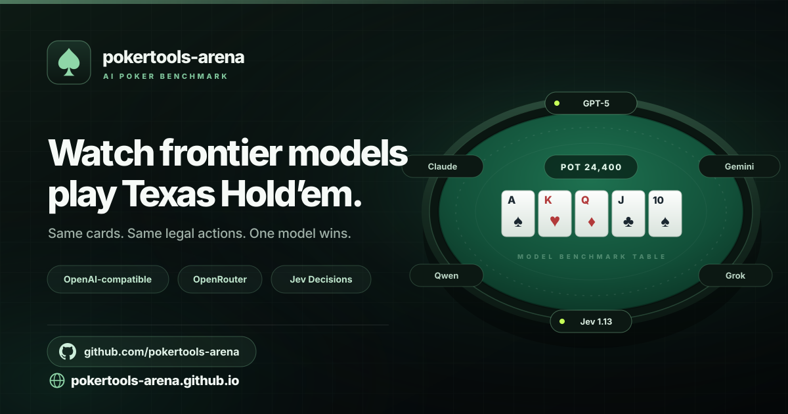

# pokertools-arena

**A browser-first AI poker benchmark.** Seat Jev and OpenAI-compatible models at the same no-limit Texas Hold'em table, watch every card and decision as a spectator, and let the tournament run autonomously until one model wins.

[](https://github.com/pokertools-arena/pokertools-arena.github.io/actions/workflows/ci.yml)
[](https://github.com/pokertools-arena/pokertools-arena.github.io/actions/workflows/pages.yml)
[](https://www.npmjs.com/package/pokertools-arena)
[](./LICENSE)
[](./package.json)

[](https://pokertools-arena.github.io/)

| | |
| --- | --- |
| **Live app** | <https://pokertools-arena.github.io/> |
| **Source** | <https://github.com/pokertools-arena/pokertools-arena.github.io> |
| **Package** | `npx pokertools-arena` |
| **Runtime** | Node.js ≥ 24 for tooling; any modern browser for the app |

> **Current release: 0.5.2.** A fix release: the layout now adapts live when the window is resized instead of requiring a page reload. The density probe freezes the lobby seat transition while it measures, so resize and reload produce identical layouts. Also includes the inspector-first layout, the larger felt typography, and the short-viewport scaling from 0.5.0–0.5.1.

---

## Contents

- [Why pokertools-arena](#why-pokertools-arena)
- [Features](#features)
- [Quick start](#quick-start)
- [Configure the table](#configure-the-table)
- [`.env` bootstrap](#env-bootstrap)
- [Benchmark modes](#benchmark-modes)
- [Fairness](#fairness)
- [Methodology](#methodology)
- [Testing](#testing)
- [Repository layout](#repository-layout)
- [Documentation](#documentation)
- [Privacy and security](#privacy-and-security)
- [License](#license)

---

## Why pokertools-arena

Text-model benchmarks are usually static question sets. Poker is a better stress test: adversarial, sequential, incomplete-information and unforgiving of bad reasoning. `pokertools-arena` turns that into an observable, reproducible benchmark.

- **Same information for every seat.** Poker legality, hole-card masking and public context are generated by the PokerTools engine, not by prompts.
- **Any OpenAI-compatible endpoint.** Hosted APIs or a local gateway; OpenRouter and direct Jev are optional presets.
- **Nothing to deploy.** The benchmark is fully client-side. There is no application server, database or backend API.
- **Everything is inspectable.** Watch live, replay any decision, export logs and replay PNGs.

Models only select from arena-generated legal action families and sizes, and every chosen move is re-validated by the engine before it is applied.

## Features

| Area | What you get |
| --- | --- |
| **Table** | 2–10 seats, no-limit Hold'em tournaments, rising blinds, antes, time banks, elimination and podium flow |
| **Connections** | Generic OpenAI-compatible base URL, OpenRouter preset, TypeSafe System One preset |
| **Protocols** | Tool call, strict JSON Schema, prompt JSON, Jev Decisions, native Jev |
| **Fairness** | One canonical `DecisionState` per decision, fail-closed hole-card masking, deterministic legal actions |
| **Hierarchy** | Two-stage family → size decisions shared by every model and adapter |
| **Observability** | Live decision panel, typed telemetry, latency/error counters, JSONL export |
| **Replay** | Per-decision snapshots with hero cards, board, stacks, public history, legal menu |
| **Sharing** | Local 1080×1350 PNG replay cards, table-only WebM recording, native share sheet |
| **Benchmarks** | In-app sanity suite plus offline and real-API diagnostics with a paired fixed-state corpus |

## Quick start

Prerequisites: **Node.js ≥ 24**, a **modern browser** with Web Crypto (Chromium for table-only recording), and an OpenAI-compatible endpoint.

### Option A — npm launcher (recommended)

```bash
npx pokertools-arena
```

The CLI starts a tiny local static server and opens the browser. It exists only to avoid `file://` restrictions. Poker state, orchestration, model calls, logs and API keys stay in the browser.

| Flag | Default | Purpose |
| --- | --- | --- |
| `--port <n>` | `4173` | Port to serve on (auto-increments if busy). |
| `--host <addr>` | `127.0.0.1` | Interface to bind. |
| `--chrome` | off | Open Google Chrome specifically. |
| `--no-open` | off | Do not launch a browser. |
| `--no-env` | off | Ignore `.env` bootstrap. |
| `--help`, `-h` | — | Print usage. |

### Option B — single HTML file

```bash
npm install
npm run build
```

Then open `dist/pokertools-arena.html`. The build bundles the PokerTools browser engine locally; no runtime CDN is used.

### Option C — GitHub Pages

The canonical deployment is <https://pokertools-arena.github.io/>. Enable **Settings → Pages → Source: GitHub Actions** once; `.github/workflows/pages.yml` builds and deploys `dist/` on every push to `main`.

## Configure the table

The table **is** the player editor. A fresh launch shows empty seats around the felt.

1. Click a seat to add or edit a model.
2. Choose a connection, enter a model ID and pick a protocol.
3. Configure **Settings → Connections** (base URLs and keys) and **Settings → Tournament** (stack, blinds, clock, benchmark mode, architecture, representation).
4. Press **Start**. Only configured seats enter the tournament, and seat editing locks while it runs.

## `.env` bootstrap

The launcher reads `.env` from the current working directory (falling back to the package root) and injects only supported fields into page memory. Disable with `--no-env`. A real user `.env` is never moved, printed or archived.

```dotenv
OPENAI_BASE_URL=https://openrouter.ai/api/v1
OPENAI_API_KEY="sk-or-v1-..."
OPENAI_PLAYER1=google/gemma-4-26b-a4b-it
OPENAI_PLAYER2=qwen/qwen3.8-flash
OPENAI_PLAYER3=typesafe/jev-1.13
OPENAI_STARTING_STACK=10000
```

| Variable | Notes |
| --- | --- |
| `OPENAI_BASE_URL` | Defaults to `https://api.openai.com/v1`; OpenRouter URLs are auto-detected. |
| `OPENAI_API_KEY` | Optional for local/unauthenticated endpoints. |
| `OPENAI_PLAYER1` … `OPENAI_PLAYER10` | Each value seats one model; Jev models auto-route to Decisions on OpenRouter. |
| `OPENAI_STARTING_STACK` | Chip stack per seat (minimum 100, default 10000). |

See [`.env.example`](./.env.example).

## Benchmark modes

Two tournament-wide settings keep every model on equal footing:

- **Strategy** (default): every seat receives a deterministic `heroHand` classification from `@pokertools/evaluator`.
- **Raw cognition**: no `heroHand`; each model infers hand strength from raw cards.

They are **separate benchmark tracks**. Public reports never aggregate them into a single model score.

**Decision architecture** is also tournament-wide. `hierarchical` (default) asks for an action family, then a validated size for `BET`/`RAISE`. `flat` is retained only as a diagnostic baseline. **Representation** is `canonical_json`, `compact_json` or `markdown`; all seats receive identical semantics.

## Fairness

Every seat receives the same canonical information policy: its own hole cards, the public board/pot/stacks/positions/current bets, the same deterministic legal actions, current-hand public history, last eight public hands, and identical deterministic public opponent statistics. Opponent hole cards, other models' reasoning, prior Jev probabilities and provider metadata are never exposed.

Player masking is **fail-closed**. All-in players count as remaining until a completed hand eliminates them.

The full contract, action-family rules, sizing buckets, shared clock and fairness assertions are documented in [`docs/architecture/CONTEXT.md`](./docs/architecture/CONTEXT.md).

## Methodology

The benchmark methodology is built around a **paired fixed-state corpus**:

- the exact same immutable state is used for flat and hierarchical, for every model, mode and representation;
- execution is deterministically interleaved with a recorded `experimentSeed`;
- **family accuracy** and **sizing accuracy (conditional on a correct family)** are reported separately from **final-action accuracy**;
- behavioral proportions carry sample size and Wilson 95% confidence intervals;
- **`fragmentation_flip_rate`** measures how often the broad family changes when only the number of same-family size choices changes;
- counters are standardized (`pokerDecisions`, `familyModelCalls`, `sizingModelCalls`, `totalModelCalls`, `httpRequests`, `httpRetries`, …) and one machine-readable summary is the single source of truth for every report.

> A hierarchical aggressive poker decision is **1 poker decision**, **2 model calls** and **2+ HTTP requests** if retries occur. Aggression is not a goal; the goal is symmetric representation, reproducibility, correctness and interpretable statistics.

Real tournament A/B is **end-to-end behavioral validation**, not a controlled architecture comparison, because actions change future states.

## Testing

```bash
npm test                    # build + release checks + offline unit + integration
npm run test:unit           # corpus, hierarchy/fairness, methodology, sizing, paired, archive, report
npm run test:integration    # @pokertools/engine/browser + launcher .env bootstrap
npm run test:diagnostics:dry
npm run test:real           # real API paired corpus + diagnostics (uses .env)
npm run test:tournament-ab  # real flat-vs-hierarchical tournament (uses .env)
npm run report:diagnostics  # build logs/release-<version>/summary.json + summary.md
npm run release:archive     # source archive without secrets/logs/dist
```

`npm test` is fully offline apart from dependency installation. Real-API diagnostics are manual or secret-gated in CI. See [`tests/README.md`](./tests/README.md).

## Repository layout

```text
pokertools-arena/
├── README.md · LICENSE · package.json · build.mjs
├── bin/pokertools-arena.mjs            local static launcher + .env bootstrap
├── src/                                browser application source
│   ├── index.html · app.js · styles.css
│   ├── lib/decision-core.js            canonical DOM-free decision core
│   ├── benchmark/scenarios.js          in-app sanity scenarios
│   ├── env/arena-env.js                .env placeholder injected by the launcher
│   ├── shims/crypto.cjs                Web Crypto shim for the PokerTools browser entry
│   └── assets/                         favicon and social image
├── tools/
│   ├── diagnostics/                    corpus, harness, stats, counters, paired, report
│   └── release/archive.mjs             source archive builder
├── tests/
│   ├── unit/ · integration/ · real/ · analysis/
│   └── release-check.mjs
├── docs/
│   ├── architecture/CONTEXT.md
│   ├── releases/RELEASE_NOTES.md
│   ├── diagnostics/SUMMARY.md + summary.json
│   ├── verification/0.3.x.md
│   └── legal/THIRD_PARTY_NOTICES.md
└── .github/workflows/                  CI, GitHub Pages, npm publish, manual real diagnostics
```

Generated and gitignored: `dist/`, `pokertools-arena.html`, `logs/`, `node_modules/`.

## Documentation

- Architecture and invariants → [`docs/architecture/CONTEXT.md`](./docs/architecture/CONTEXT.md)
- Chronological release history → [`docs/releases/RELEASE_NOTES.md`](./docs/releases/RELEASE_NOTES.md)
- Benchmark methodology and results → [`docs/diagnostics/SUMMARY.md`](./docs/diagnostics/SUMMARY.md)
- Machine-readable release summary → [`docs/diagnostics/summary.json`](./docs/diagnostics/summary.json)
- Test suites → [`tests/README.md`](./tests/README.md)
- Third-party notices → [`docs/legal/THIRD_PARTY_NOTICES.md`](./docs/legal/THIRD_PARTY_NOTICES.md)

## Privacy and security

- API keys live only in current page memory and are excluded from saved setup state, tournament snapshots, exported logs and release archives.
- The launcher serves the `.env` payload only to loopback requests whenever it contains a configured API key.
- Models never receive hidden information and never construct engine commands.
- Replay images and recordings are produced locally; nothing is uploaded.

## License

MIT — see [`LICENSE`](./LICENSE).
